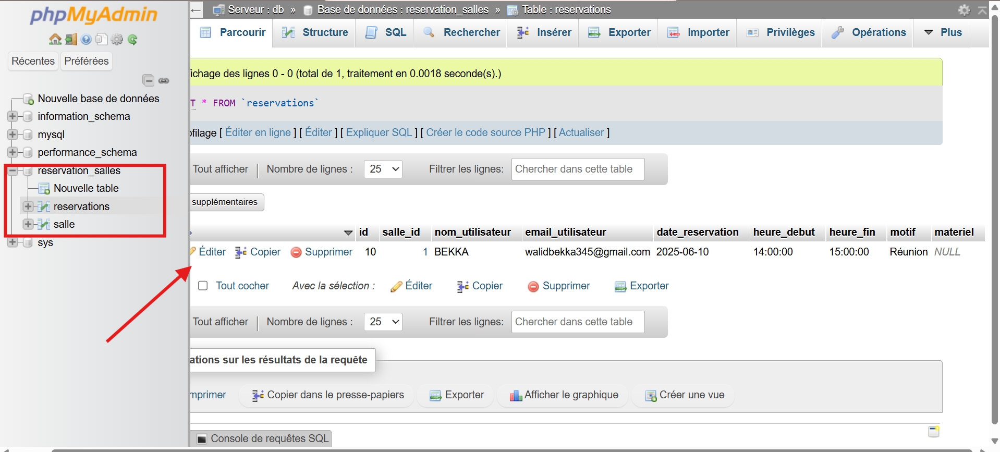

# Compte rendu du projet : Système de réservation de salles - Calid

## 1. Présentation du projet

### Contexte
Ce projet s'inscrit dans le cadre du BTS SIO (Services Informatiques aux Organisations), option SLAM (Solutions Logicielles et Applications Métiers). L'objectif est de concevoir un système de réservation de salles pour une entreprise fictive spécialisée en cybersécurité, nommée **Calid**.

### Objectif
Permettre aux utilisateurs de réserver des salles en indiquant :
- Le nom du demandeur
- La date et l’heure souhaitées
- L’objectif de la réservation
- Le matériel nécessaire

### Technologies utilisées
- **PHP** (programmation serveur)
- **MySQL** (base de données)
- **HTML/CSS** (interface utilisateur)
- **Docker / Docker Compose** (environnement de développement)
- **Git / GitHub** (gestion de version)

---

## 2. Architecture du projet

```
reservation_salles/
│
├── app/
│   ├── controllers/
│   ├── models/
│   └── views/
├── config/
├── docker/
├── public/
├── images/
├── docker-compose.yml
├── .gitignore
├── init.sql
└── README.md
```

---

## 3. Mise en place de l’environnement de développement

### Docker / Docker Compose
Un fichier `docker-compose.yml` est utilisé pour lancer :
- un conteneur PHP/Apache
- un conteneur MySQL
- une interface phpMyAdmin


### Base de données
Le script `init.sql` permet de créer la base `reservation_salles` avec une table `reservations` contenant les champs nécessaires (nom, date, heure, objectif, matériel).




### Commandes utiles
```bash
docker-compose up -d
docker-compose down
docker exec -it <nom_conteneur_php> bash
```
---


## 4. Développement de l’application

### Fichier `index.php`
- Formulaire de réservation avec vérification des champs
- Affichage des réservations existantes
- Suppression des réservations via des boutons dédiés
- Impossible de réserver un salle au même moment

### Fichier `Reservation.php`
- Classe `Reservation` gérant :
    - l’ajout d’une réservation
    - la récupération de toutes les réservations
    - la suppression d’une réservation
    - la récupération de la liste des salles

### Sécurité
- Utilisation de requêtes préparées pour éviter les injections SQL

---


- On ne peut réserver ma même salle à la même dâte ainsi qu'au même moment :


## 5. Ajouts complémentaires

- Compteur de réservations visibles sur l’interface
- Message de confirmation après suppression
- Ajout d’une **favicon**
- Ajout d’un **footer** avec des informations (nom du projet, auteur...)
- Validation des champs et sécurité de base côté PHP

---

## 6. Utilisation de Git et GitHub

### Initialisation du dépôt local
```bash
git init
git add .
git commit -m "Initial commit"
```

### Connexion à GitHub
```bash
git branch -M main
git remote add origin https://github.com/Walid0570/Calid-reservation-salles.git
git push -u origin main
```

### Problèmes rencontrés et solutions
- **Git non reconnu dans PHPStorm** : correction du chemin dans les paramètres
- **Terminal qui se ferme** : mise à jour de Git Bash + configuration du shell dans PHPStorm
- **Erreur “Author identity unknown”** : configuration avec `git config --global user.name` et `user.email`
- **Erreur “src refspec main does not match any”** : causée par l’absence de commit avant le push

---

## 7. Conclusion

Ce projet a permis de :
- Mettre en œuvre une architecture MVC simple en PHP
- Utiliser Docker pour créer un environnement isolé et reproductible
- Travailler avec Git et résoudre des problèmes concrets de versioning
- Concevoir une application complète avec formulaire, base de données, suppression, validation et affichage dynamique

**Améliorations futures possibles :**
- Authentification des utilisateurs
- Système de filtres ou de recherche
- Tableau de bord pour l’administrateur

